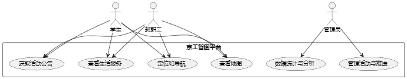
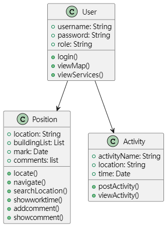
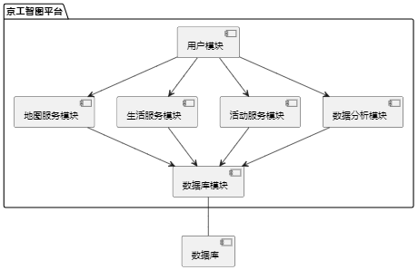
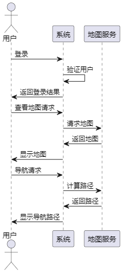
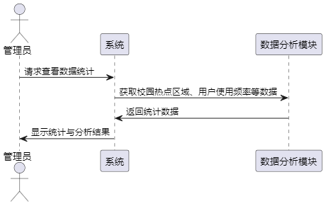
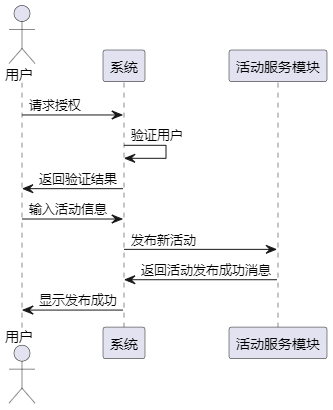

    <h1>系统建模文档 - 京工智图平台</h1>

## 1.**软件用例** 
此部分我们通过用例图展示用户（学生、教职工、管理员）如何与系统进行交互，系统支持的主要功能包括查看地图、定位和导航、查看生活服务、获取活动公告、管理活动与推送、数据统计与分析。

学生和教职工有相似的功能：可以查看地图、定位和导航、查看生活服务和获取活动公告。
管理员除了拥有基本功能外，还可以管理活动和进行数据统计分析。

    

## 2. **类**
京工智图系统的主要类包括用户（User）、位置管理（Position）、活动管理（Activity）等。
* User 类代表系统中的用户，包含登录、查看地图和查看服务的功能。
* Position 类管理用户定位、导航和搜索功能，还支持显示工作时间、添加评论和显示评论。
* Activity 类管理校园活动的发布和查看。
* 

      
  

---
---
## 3. **组件**
从组件上来介绍，京工智图由用户模块、地图服务模块、生活服务模块、活动服务模块、数据分析模块和数据库模块组成。
**用户模块**是入口，用户通过该模块与其他服务模块交互。
**地图服务模块**处理用户的地图请求。
**生活服务模块**处理自习室、食堂等生活服务信息。
**活动服务模块**处理校园活动信息的推送与管理。
**数据分析模块**用于生成统计和分析数据，帮助管理员做决策。
**数据库模块**存储所有相关数据，包括用户信息、活动信息、地图信息等。

    

## 4. **顺序图**

顺序图展示了系统中不同对象或模块之间在时间上的交互过程，它帮助理解在执行某项功能时，系统内部不同组件如何进行通信。以下为该系统的主要功能顺序图及其描述。

### 4.1 **用户登录、查看地图和导航顺序图**

该顺序图展示了用户从登录到查看地图及导航的整个交互过程。
用户与系统以及地图服务模块之间的通信流程如下：
1. **登录**：用户发起登录请求，系统验证用户的身份信息（如用户名、密码等）。如果验证通过，系统返回登录成功结果，用户即可继续操作。
   
2. **查看地图**：登录成功后，用户可以请求查看校园地图。系统接收到请求后，与地图服务模块通信以获取地图数据，并将地图数据返回给用户。

3. **导航**：用户在查看地图后，可以发起导航请求，指定目的地。系统将导航请求发送给地图服务模块，地图服务模块计算从当前位置到目的地的最佳路径，并将路径数据返回给系统。系统最后将导航路径展示给用户。

    

### 4.2 **管理员查看数据统计顺序图**

该顺序图展示了管理员请求查看数据统计的交互过程，系统与数据分析模块之间的通信如下：
1. **请求数据统计**：管理员向系统发送请求，要求查看校园内的热点区域和用户频率等数据统计信息。

2. **数据分析**：系统接收到请求后，向数据分析模块发送查询请求，获取相关的统计数据。

3. **返回结果**：数据分析模块处理请求并返回校园热点区域和用户使用频率的数据，系统将这些统计和分析结果展示给管理员，帮助其做出决策。

4. 

       
   

---
### 4.3 **授权用户发布活动顺序图**

该顺序图展示了授权用户发布新活动的流程，包括用户的授权验证和活动发布的交互过程：

1. **授权验证**：授权用户首先发起授权请求，系统验证授权用户的身份和权限，确保其有权限发布活动。

2. **活动发布**：身份验证通过后，授权用户输入活动信息，系统将这些信息传递给活动服务模块进行处理。

3. **确认发布**：活动服务模块成功处理活动发布后，返回发布成功的确认信息，系统向管理员显示发布结果。

4. 

       
   

